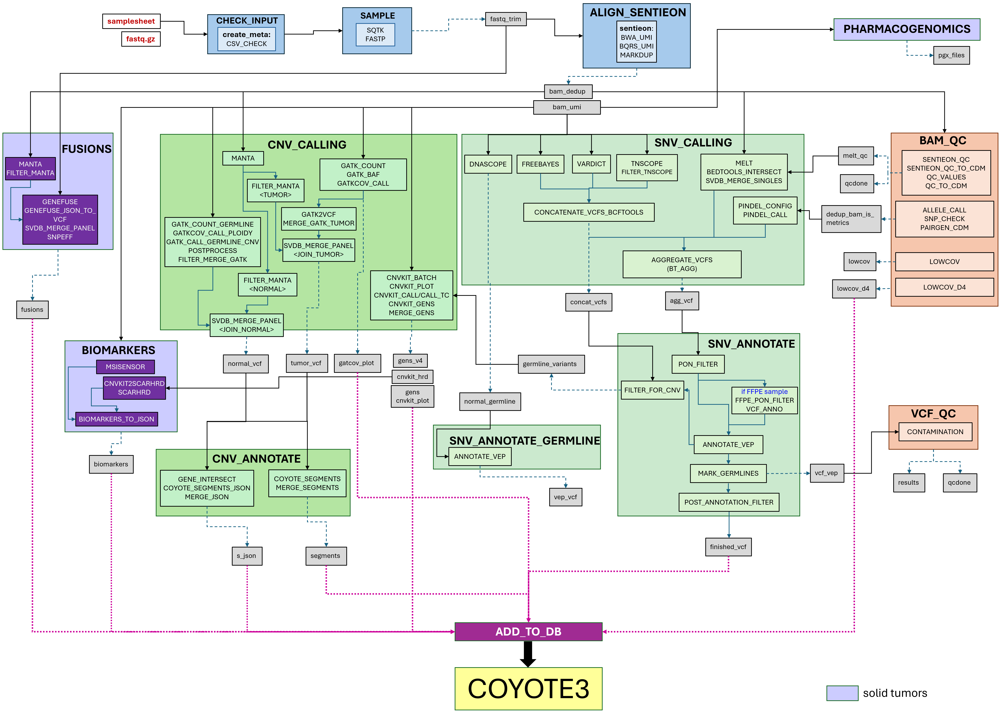

# README
SomaticPanelPipeline (SPP)  is a Nextflow DSL2 pipeline for somatic variant detection and annotation in targeted gene panel sequencing data from patients. It is developed and maintained by the Center for Molecular Diagnostic, Lund (CMD Lund) and is designed to run on a Slurm HPC cluster using Singularity containers.
The pipeline supports multiple cancer panel assays — myeloid, lymphoid, solid tumors and PARP inhibitor response — handles both tumor-only and tumor-normal paired samples, as well as FFPE samples.
Starting from raw FASTQ files, SPP performs alignment, quality control, SNV/indel and CNV callings, fusion detection, and biomarker estimation. Results are aggregated and imported into the [Coyote](https://github.com/SMD-Bioinformatics-Lund/coyote3) variant interpretation database.

## Table of content

* [Pipeline overview](docs/pipeline_overview.png)
* [Running the pipeline](docs/running_the_pipeline.md)
* Input:
    * [auxiliary files](docs/auxiliary_files.md)
    * [containers](docs/containers.md)
    * [Sentieon license](docs/containers.md)
* [List of used softwares](docs/list_of_used_softwares.md)

## Pipeline overview

The SomaticPanelPipeline

A typical workflow

1. Validate input CSV and optionally downsample and trim the reads
2. Align reads to the reference genome using Sentieon BWA, mark duplicates and perform base quality score recalibration
3. Calculate alignment QC metrics, coverage, verify normal/tumor sample identity using ID-SNPs
4. Call SNVs and indels across genomic regions using Freebayes, VarDict, and optionally TNscope and Pindel
5. Filter SNVs against panel-of-normals (PoN), annotate with VEP, then mark germline variants
6. Call CNVs using CNVkit and GATK, detect structural variants with Manta
7. Annotate CNV calls with gene information
8. Detect DNA fusions and compute microsatellite instability (MSI) and homologous recombination deficiency (HRD) scores (solid tumors only)
9. Aggregate all results and import into the Coyote variant interpretation database

Pipeline overview:
